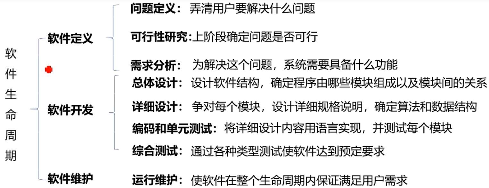
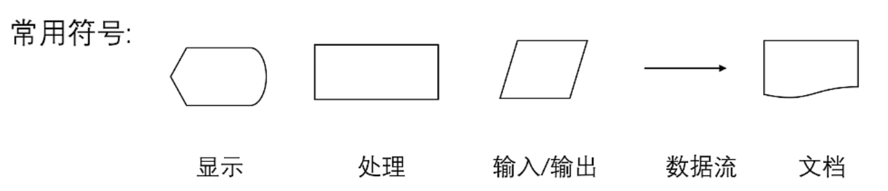
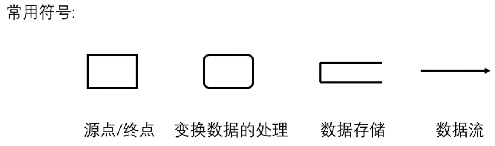
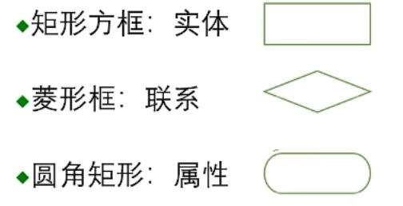
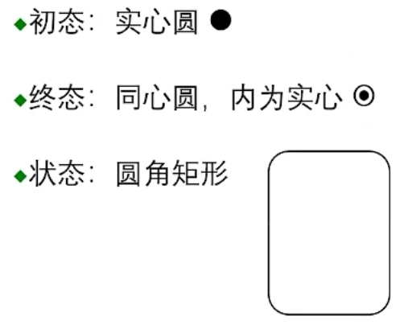
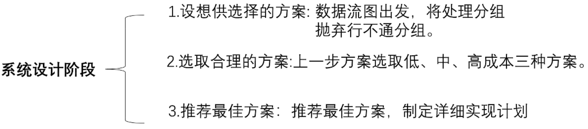
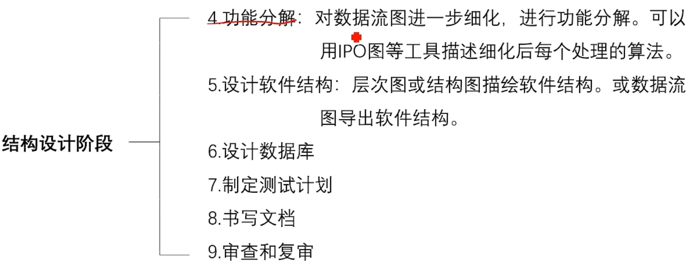
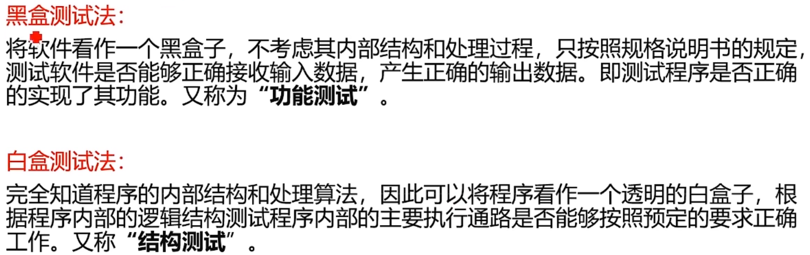

# 软件工程

> 注意：目录中标有⭐的为重点考查内容

## 软件的概念、特点与发展

软件发展经历三个阶段：

程序设计阶段——50至60年代

程序系统阶段——60至70年代

软件工程阶段——70年代以后

软件的概念：

软件是计算机系统中与硬件相互依存的另一部分，它包括程序、数据及其相关文档的完整集合。（软件 = 程序 + 数据 + 文档）

软件的特点：

1. 软件本身的复杂性
2. 软件的成本高昂
3. 软件开发未摆脱手工开发方式
4. 软件维护与硬件维护有本质的差别，维护难度高
5. 软件开发不是传统硬件制造过程
6. 软件是一种逻辑实体，无磨损性

## 软件危机

在计算机软件开发和维护过程中所遇到的一系列严重问题。

软件危机包含两方面内容：

1. 如何开发软件，以满足对软件日益增长的需求
2. 如何维护数量不断膨胀的已有软件

软件危机的表现：

- 对软件开发成本和进度估算不准确
- 用户对已完成软件不满意
- 软件质量不可靠
- 软件不可维护
- 没有适当文档资料
- 软件成本在计算机系统中所占比例逐年上升
- 软件开发生产率低

## 软件工程概述

采用工程的概念、原理、技术和方法来开发与维护软件，把经过时间考验而证明正确的管理技术和当前能够得到的最好的技术方法结合起来，经济的开发出高质量的软件并维护它。

软件工程的本质特性：

- 关注大型程序的构造
- 中心课题是控制复杂性
- 软件经常变化
- 开发效率非常重要
- 开发人员和谐合作是关键
- 软件需要有效支持用户
- 软件开发替代其他领域人员创造产品

软件工程的基本原理：

- 按软件生存期分阶段指定计划并认真实施
- 坚持进行阶段评审
- 坚持严格的产品控制
- 使用现代程序设计技术
- 结果能够得到清楚的审查
- 用人少而精
- 承认不断改进软件工程实践的必要性

软件工程方法学：

把在软件生命周期全过程中使用的一整套技术方法的集合称为方法学，也称为泛型。

软件工程方法学包括三个要素：方法、工具和过程

软件工程方法学分类：传统方法学和面向对象方法学

## 软件生命周期

## 软件过程

软件过程：是为了获得高质量软件所需要完成的一系列任务框架

通常用软件生命周期模型描述软件过程

- 瀑布模型
- 快速原型模型
- 增量模型
- 螺旋模型
- 喷泉模型
- 其他模型

瀑布模型：将软件生命周期的各项活动规定为依照固定顺序连接的若干阶段工作，最终得到软件产品。

特点：

1. 阶段间具有顺序性和依赖性
2. 推迟实现的观点
3. 质量保证的观点

快速原型模型：快速建立可运行的程序，它完成的功能往往是最终产品功能的一个子集

优点：1. 开发的软件产品通常满足用户需求 2. 软件产品开发基本是线性过程

缺点：1. 准确原型设计困难 2. 原型理解可能不同 3. 不利于开发人员创新

增量模型：先完成一个系统子集的开发，再按同样的开发步骤增加功能（系统子集），如此递增下去直至满足全部系统需求

优点：1. 短时间内可提交完成部分功能 2. 逐渐增加产品功能，用户适应产品快

缺点：1. 增量构件划分以及集成困难 2. 容易退化为边做边改模型

螺旋模型：在每个阶段之前都增加了风险分析过程的快速原型模型

可以看作是增加了风险分析的快速原型模型

优点：

1. 利于把软件质量作为软件开发目标
2. 减少测试
3. 维护和开发不分开

缺点：风险评估困难

喷泉模型：典型的面向对象软件过程模型，体现迭代和无缝的特性

## 可行性研究任务

可行性研究目的：用最小的代价在最小的时间内确定问题是否能够解决

可行性研究实质：系统分析和设计过程的大大压缩和简化，在较高层次上以较为抽象的方式进行系统的分析和设计过程

可行性研究过程：

1. 分析和澄清问题定义
2. 导出系统的逻辑模型（数据流图+数据字典）
3. 根据逻辑模型探索若干种可供选择的解法
4. 研究每种解法的可行性
   - 经济可行性：经济效益是否大于开发成本
   - 技术可行性：现有技术能否实现
   - 操作可行性：系统操作方式是否可行
   - 其他可行性：法律、社会效益等

## 可行性研究内容

可行性研究步骤：

1. 复查系统规模和目标
2. 研究目前正在使用的系统
3. 导出新系统的高层逻辑模型
4. 进一步定义问题
5. 导出和评价供选择的解法
6. 推荐行动方针
7. 草拟开发计划
8. 书写文档提交审查

## 系统流程图

一种描述物理系统的图，用图形符号以黑盒子形式描绘物理系统的各部件，表达数据在系统各部件之间流动的情况，而不是对数据进行加工处理的控制过程

## 数据流图与数据字典⭐

数据流图（DFD）：描述信息流和数据从输入到输出过程所经受的变换。没有任何具体物理部件，只是描绘数据在软件中流动和被处理的逻辑过程。

数据流图画法：

（1）确定系统输入输出、源点以及终点

（2）画系统顶层数据流图

（3）自顶向下分解，画出分层数据流图

数据字典：是关于数据的信息集合，即对数据流图中包含的所有元素定义的集合

1. 数据字典的内容：数据流、数据流分量（数据元素）、数据存储、处理
2. 定义数据的方法：由数据元素组成数据的方式：顺序、选择、重复、可选

数据字典用途：在软件分析和设计的过程中给人提供关于数据的描述信息

- 作为分析阶段的工具
- 估计改变一个数据将产生的影响
- 是数据库开发的第一步

## 成本效益分析

目的：从经济角度分析新系统的开发是否能盈利，帮助使用部门正确做出是否投资的决定

成本估计：

1. 代码行技术（`软件成本 = 每行代码的平均成本 * 源代码行数`）

2. 任务分解技术：按开发阶段将系统划分成任务

   `每个任务的成本 = 人力 * 人平均工资`

   `软件成本 = sum(独立任务的成本)`

成本分析的步骤：

1. 估计开发成本、运行费用和新系统带来的经济效应
2. 比较新系统的开发成本和经济效益

成本分析的方法：

1. 货币的时间价值 `F = P(1 + i)`
2. 投资回收期
3. 纯收入
4. 投资回收率

## 需求分析⭐

需求分析的任务：

- 确定对系统的综合要求
- 分析系统的数据要求
- 导出系统的逻辑模型
- 修正系统开发计划

与用户沟通获取需求的方法

- 访谈
- 面向数据流自顶向下求精
- 简易的应用规格说明技术
- 快速建立软件原型

分析建模

模型：是指为了理解事物而对事物做出的一种抽象，是对事物的一种无歧义的书面描述

模型分类：

- 数据模型：（实体-联系图）描述数据对象及数据对象之间的关系
- 功能模型：（数据流图）描述数据在系统中流动时被处理的逻辑过程，指明系统具有的变换数据的功能
- 行为模型：（状态转换图）描绘系统的各种行为模型在不同状态间转换的方式

## 实体联系图（E-R图）⭐

实体：描述数据对象

属性：描述数据对象的性质

联系：描述数据对象之间的交互方式

- 一对一联系（1:1）
- 一对多联系（1:M）
- 多对多联系（M:N）

表示方式：

    

## 状态转换图

状态：系统的行为模型，包括初态、终态、中间状态

事件：是指在某个特定时刻发生的事情，即对系统从一个状态转换到另一个状态的事件抽象

表示方式：

    

在一张状态图中只能有一个初态而终态可以有0至多个

## 其他图形工具

（1）层次方框图：用树形结构的一系列矩形框描绘数据的层次结构

（2）Warnier图：用树形结构描绘信息的层次结构

（3）IPO图：是输入、处理、输出图的简称，能够方便地描绘输入数据、对数据地处理和输出数据之间地关系

## 验证软件需求

（1）从哪些方面验证软件需求地正确性？

- 一致性：所有需求必须是一致的，任何一条需求不能和其他需求相互矛盾
- 完整性：需求必须是完整的，规格说明书应该包括用户需要的每一个功能或性能
- 现实性：指定的需求应该能用现有的硬件和软件技术可以实现
- 有效性：必须证明需求是正确有效的，确实能解决用户面对的问题

（2）验证软件需求的方法

- 验证需求的一致性：自然语言描述需求、形式化语言描述需求、用软件工具验证
- 验证需求的现实性：参照开发经验
- 验证需求的完整性和有效性：建立软件原型

（3）用于需求分析的软件工具

- PSL/PSA（问题陈述语言/问题陈述分析程序）系统

## 设计过程

总体设计又称为概要设计或初步设计

任务：

- 确定系统中每个程序由哪些模块组成以及这些模块相互间的关系
- 划分出物理元素，包括程序、文件、数据库、文档等

设计过程包括系统设计阶段和结构设计阶段

设计原理：模块化、抽象、逐步求精、信息隐藏与局部化、模块独立

耦合：对一个软件结构内不同模块之间互联程度的度量

耦合强度取决于模块接口的复杂程度、通过接口的数据等

耦合性越高，模块独立性越弱

耦合分类（程度从低到高）：

`无直接耦合 -> 数据耦合 -> 标记耦合（特征耦合） -> 控制耦合 -> 外部耦合 -> 公共耦合`

内聚：度量一个模块内部各个元素彼此结合的紧密程度

内聚分类（程度从低到高）：

`偶然内聚 -> 逻辑内聚 -> 时间内聚 -> 过程内聚 -> 通信内聚 -> 顺序内聚 -> 功能内聚`

软件设计的目标：高内聚，低耦合

## 详细设计

目的：确定怎样具体地实现所要求地系统。得出对目标地精确描述

任务：

- 过程设计：即设计软件体系结构中所包含地每个模块地实现算法
- 数据设计：设计软件数据结构
- 接口设计：设计软件内部各模块之间地接口

结构程序设计：只用三种基本地控制结构就能实现任何单入口单出口地程序

三种基本控制结构：

1. 选择结构
2. 顺序结构
3. 循环结构

过程设计工具

- 程序流程图
- 盒图（N-S图）
- PAD图
- 判定表
- 判定树
- 过程设计语言（PDL）

## 实现与测试

实现：软件生命周期中的编码和测试统称为实现

软件测试的目标：

软件测试是为了发现错误而执行程序的过程

编码阶段（单元测试）

测试阶段（各种综合测试）

软件测试的方法：黑盒测试和白盒测试

软件测试的步骤：

1. 单元测试（模块测试）
2. 子系统测试
3. 系统测试
4. 验收测试（确认测试）
5. 平行运行

单元测试

依据：详细设计文档

测试技术（设计测试用例的方法）：白盒测试技术

着重点：

1. 模块接口
2. 局部数据结构
3. 重要的执行通路
4. 出错处理通路
5. 边界条件

集成测试

目标：发现与接口有关的问题

实施者：独立的测试机构或第三方人员

集成方法：非渐增测试、渐增测试

回归测试：重新执行已经做过测试的某个子集，以保证程序的变化没有带来非预期的副作用

确认测试：又称验收测试，目标是验证软件的有效性

白盒测试

测试用例：测试输入数据和预期的输出结果

测试方案：测试目的、测试用例的集合

- 语句覆盖
- 判定覆盖
- 条件覆盖
- 判定/条件覆盖
- 条件组合覆盖
- 路径覆盖

黑盒测试

又称为功能测试，着重测试软件的功能

等价类划分法

（1）把程序的输入数据集合按输入条件划分为若干等价类，每一个等价类相对于输入条件表示为一组有效或无效的输入

（2）为每一等价类设计一个测试用例

边界值分析法：输入等价类和输出等价类的边界就是应该着重测试的程序边界情况。选取的测试数据应该刚好等于、刚好小于、刚好大于边界值

